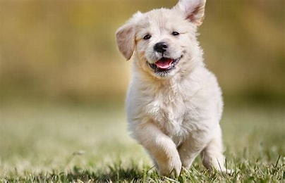
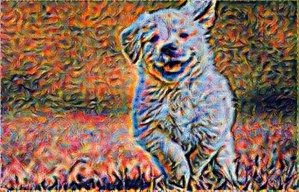
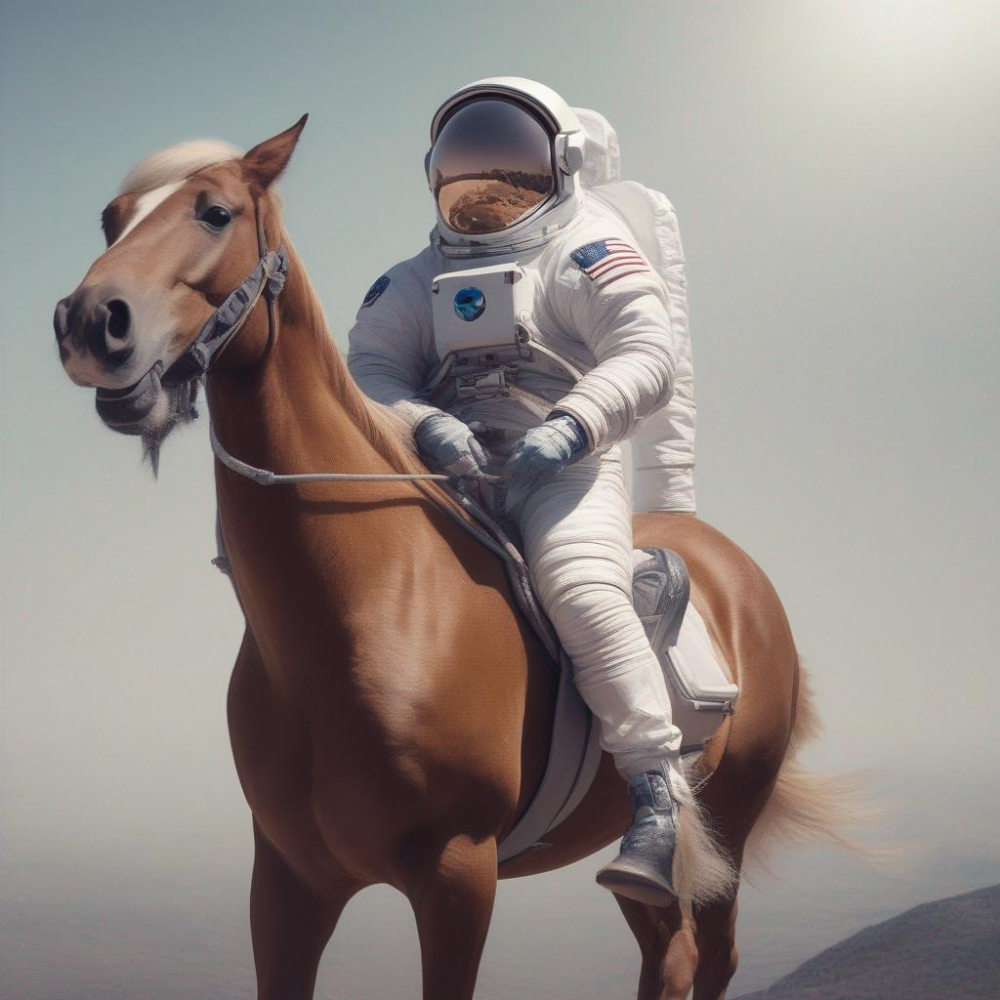

# Flask-AI
A webiste I created to showcase my AI projects.

Here is what you can do on my website:

**AI Image Styler**: This project uses AI to style an image based on another image. Given a detail image and a style image, it combines the details and styles of both to create a new image. For example, you can turn a photo of yourself into a painting or a sketch. 

**AI Blog Generator**: This project uses AI to create a blog page given the title of the blog. It generates the content and layout, for the blog based on the topic and the tone that you specify. For example, you can create a blog about your favorite hobby or a travel destination.

**AI Chat Bot**: This project uses AI to create a basic chat bot that can converse with you on various topics. It uses natural language processing and generation to understand your messages and respond appropriately. For example, you can chat with it about the weather, sports, or movies.

**Use AI to answer questions about your images**: This project uses AI to answer your questions about your images.

**Use AI to Generate Image**: This project uses AI to generate your image given a prompt.

I hope you enjoy exploring my website and learning more about my AI projects. If you have any questions or feedback, feel free to contact me. Thank you for visiting!

## 1. Image Styling

Welcome to our Image Styling Website! This web application allows you to combine the details of a feature image with the style of another image to create a unique, stylized image.

### How It Works

Our website uses a sophisticated algorithm to extract the details from one image (the feature image) and the style from another image (the style image). It then combines these two to generate a new image that has the details of the feature image and the style of the style image.

### Usage

1. **Upload your images**: On the home page, you'll find an option to upload two images - the feature image and the style image. The feature image is the one whose details you want to preserve, and the style image is the one whose style you want to apply to the feature image.

2. **Style your image**: After uploading the images, click on the "Style your image" button. This will start the process of generating your stylized image.

3. **View your stylized image**: Once the image has been generated, it will be displayed on the website. You can then view or download your stylized image.

### Example
Here's an example of what you can do with this  website:

- Feature Image: A photo of a cityscape.
- Style Image: A painting by Van Gogh.
- Stylized Image: The cityscape photo rendered in the style of Van Gogh's painting.

- 
- 
- 

We hope you enjoy using our Image Styling Website!

## 2. Blog Generator

This page generates a blog post given only its title!

## 3. Chat Bot

This is a very basic chat bot

##4. Answer questions about your images

For example:

How many cats are there?
Answer: 2
## 4. Generate Images

For example:

  

 **Prompt**: An astronaut on a horse

